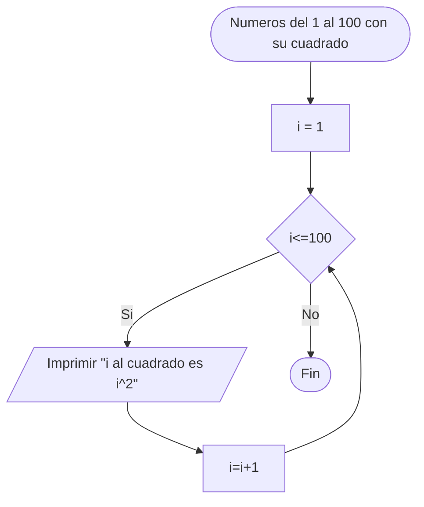
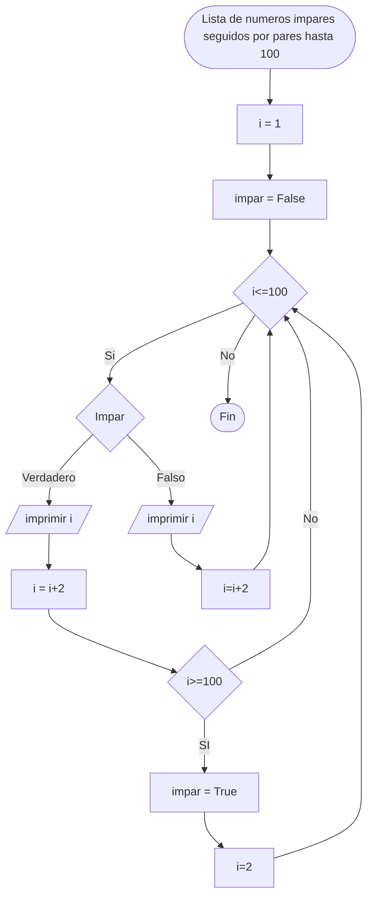
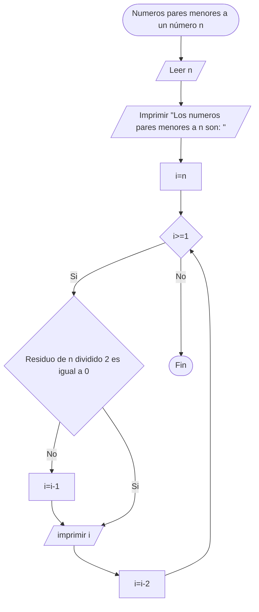

# Reto-07

### Soy Malcom Yamil Carrillo Quintero y pertenezco al grupo de "Fenomenoides", adelante se muestra nuestro logo
<details><summary>Preparense para ver el grandioso logo: </summary><p>
<div align='center'>
<figure> </br>
<figcaption><b> "somos programadores, no diseñadores" </b></figcaption></figure>
</div>
</p></details><br>

## 1. 
### Imprimir un listado con los números del 1 al 100 cada uno con su respectivo cuadrado.


``` python
i:int=1 # se inicializa i en 1
if __name__=="__main__":
    while i<=100: # mientras i sea menor o igual a 100
        print(f"{i} al cuadrado {i**2}") # imprime i "al cuadrado es " i^2
        i += 1 # actualiza i como i+1
```

## 2.
### Imprimir un listado con los números impares desde 1 hasta 999 y seguidamente otro listado con los números pares desde 2 hasta 1000.



``` python
i=1 # inicializa i como 1
impar:bool=True #inicializa la variable impar como verdadera
if __name__=="__main__":
    while i<=100: # mientras i sea menor o igual a 100
        if impar: # condicional si impar (si impar es verdadera)
            print(i) # imprimir i 
            i += 2 # actualizar i como i+2
            if i>=100: # si i es mayor o igual a 100
                impar = False # actualiza impar como falso
                i = 2 # actualiza i como 2
        else: # si la condición impar como verdadero no se cumple
            print(i) # imprimir i
            i+=2 # actualizar i como i+2
```

## 3.
### Imprimir los números pares en forma descendente hasta 2 que son menores o iguales a un número natural n ≥ 2 dado



 ``` python
if __name__=="__main__":
    n=int(input("Ingrese un numero: ")) # lee la entrada de teclado como n
    print(f"Números pares menores a {n}") # imprime un encabezado que dice "Numeros pares menores a " n
    i=n # inicializa i como n
    while i>=1: # mientras i sea mayor o igual a 1
        if n%2!=0: # si n no es divisible por 0 (n es impar)
            i-= 1 # se actualiza i como i-1
        print(i) # se imprime i
        i-=2 # actualiza i como i-2

```

## 4.
### En 2022 el país A tendrá una población de 25 millones de habitantes y el país B de 18.9 millones. Las tasas de crecimiento anual de la población serán de 2% y 3% respectivamente. Desarrollar un algoritmo para informar en que año la población del país B superará a la de A.

 ``` python
A:int=25000000 # inicializa la variable A como un entero de 25000000
B:int=18900000 # inicializa la variable B como un entero de 18900000
i:int=0 # inicializa i como 0
if __name__=="__main__":
    while A>=B: # mientras A sea mayor o igual a B
        i += 1 # i se actualza  como i+1
        A += (A*0.02) # A se actualiza como A+(A*2%)
        B += (B*0.03) # B se actualiza como B+(B*3%)
    print(f"El país B superará al país A en población en {i} años, es decir en {2022+i}") # imprimir "El país B superará al país A en población en i años, es decir en 2022+i"


```

## 5.
### Imprimir el factorial de un número natural n dado.
 ``` python
if __name__=="__main__":
    n=int(input("Ingrese un numero: ")) # n inicializa como la entrada de teclado
    i = n-1 # i inicializa como n-1
    a=n #a inicializa como n
    while i>=1: # mientras i sea mayor o igual a 1
        a *= (i) # a se actualiza como a*i
        i -= 1 # i se actualiza como i-1
    print(f"El factorial de {n} es igual a {a}") # imprime "El factorial de n es igual a a"
```

## 6.
### Implementar un algoritmo que permita adivinar un número dado de 1 a 100, preguntando en cada caso si el número es mayor, menor o igual.
 ``` python
import random as rd # se importa el paquete random como rd
n=rd.randint(1, 100) #n se inicializa como un numero random entre 1 y 100
bandera:bool=True # se inicializa la bandera
if __name__=="__main__":
    while bandera: #mientras la bandera sea verdadera
        g=int(input("Ingrese el número que adivinas: ")) # g es igual a la entrada por teclado
        if g>n: # si g es mayor a n
            print("El número es menor") # imprimir el número es menor
        elif g<n: # si g es menor a n
            print("El número es mayor") # imprimir el número es mayor
        else: # si no
            break # romper y salir del ciclo
    print(f"Felicidades, adivinaste el número que era {n}") # imprimir "Felicidades, adivinaste el número que era n"
```

## 7.
### Implementar un programa que ingrese un número de 2 a 50 y muestre sus divisores.
 ``` python
if __name__=="__main__":
    n=int(input("Ingrese un numero: ")) # n se inicializa igual a la entrada por teclado
    i=1 # i se inicializa como 1
    print(f"Los divisores de {n} son: ") # imprimir "Los divisores de n son: "
    while i<=n: # mientras i sean menor o igual a 1
        if n%i==0: # si el residuo de n dividido i es igual a 0
            print(i) # imprimir i
        i += 1 # i se actualiza como i+1
```

## 8.
### Implementar el algoritmo que muestre los números primos del 1 al 100. Nota: use funciones

 ``` python
def primo (i:int): #se definen los argumentos de la función primo
    j=2 # se inicializa j como 2
    pr:bool=False # se inicializa pr como falos
    while j<i: # mientras j sea mayor a i
        if i%j == 0: # si el residuo de i dividido j es igual a 0
            pr =False # pr es igual a falso
            break # rompe y termina el ciclo
        else: # si no
            pr= True # se actualiza pr como verdadero
        j += 1 # j se actualiza como j+1
    return pr # retorna pr
if __name__ =="__main__": #Función principal
    n=int(input("Ingrese un numero: ")) # n es igual a la entrada de teclado
    i=1 # se inicializa i como 1
    print(f"Los numeros primos desde 1 hasta {n} son: ") # se imprime "Los numeros primos desde 1 hasta n son: "
    while i<=n: # mientras i sea menor o igual a n
        if primo(i): # si lo que la función primo retorna con el argumento i es verdadero
            print(i) # imprime i
        i += 1 # i se actualiza como i+1
```
